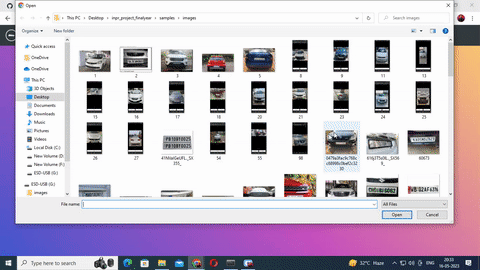

<div align="left">

  
  
  <h1>CAR NUMBER PLATE RECOGNITION</h1>
  <p align="center">
  
  
</p>
<p align="center">
  
</p>
  <p>
    Car Number Plate Detection System Using Flask and OpenCV.
    <br />
    A Website for Car Number Plate Recognition and Rto information.
  </p>
  
<br />
 :hammer_and_wrench: Languages and Tools :
<div>
  &nbsp;
  &nbsp;
  &nbsp;
  &nbsp;
  &nbsp;
  &nbsp;
  &nbsp;
  &nbsp;
  
  
</div>
<br />
  
<!-- Table of Contents -->
# :notebook_with_decorative_cover: Table of Contents

- [About the Project](#star2-about-the-project)
  * [Screenshots](#camera-screenshots)
  * [Tech Stack](#space_invader-tech-stack)
  * [Features](#dart-features)
- [Getting Started](#toolbox-getting-started)
  * [Prerequisites](#bangbang-prerequisites)
  * [Installation](#gear-installation)
  * [Run Locally](#running-run-locally)
  * [Deployment](#triangular_flag_on_post-deployment)
- [Usage](#eyes-usage)
- [Roadmap](#compass-roadmap)
- [FAQ](#grey_question-faq)
- [License](#warning-license)
- [Contact](#handshake-contact)
- [TEAM](#gem-team)

  

<!-- About the Project -->
## :star2: About the Project


<!-- Screenshots -->
### :camera: Screenshots

<div align="center"> 
  
</div>


<!-- TechStack -->
### :space_invader: Tech Stack

<details>
  <summary>Client</summary>
  <ul>
    <li><a href="https://www.python.org/">Python</a></li>
    <li><a href="https://flask.palletsprojects.com/">Flask</a></li>
    <li><a href="https://html.com/"></a>HTML</li>
    <li><a href="https://www.free-css.com/">CSS</a></li>
    <li><a href="https://www.javascript.com/">Javascript</a></li>
    <li><a href="https://getbootstrap.com/">Bootstrap</a></li>
  </ul>
</details>


<details>
<summary>Database</summary>
  <ul>
    <li><a href="https://firebase.google.com/">Google Firebase</a></li>
  </ul>
</details>

<!-- Features -->
### :dart: Features

- 👉Create a model that will detect a car in an image and recognize characters on number plate of the car .
- 👉Secondly , it will use the characters and fetch the owners information using RTO API’s .
- 👉Create a Web portal where all this information will be displayed (using Html, Css, and Javascript).

<!-- Getting Started -->
## 	:toolbox: Getting Started

<!-- Prerequisites -->
### :bangbang: Prerequisites

<!-- Installation -->
### :gear: Installation

Install my-project


<!-- Run Locally -->
### :running: Run Locally
```bash
  open Anaconda
  cd myproject
```
Clone the project

```bash
  git clone https://github.com/Samratmitra1999/FINAL-YEAR-PROJECT
```


Install dependencies

```bash
  pip install requirements.txt
```


<!-- Deployment -->
### :triangular_flag_on_post: Deployment

To deploy this project run

```bash
  python main.py
```


<!-- Usage -->
## :eyes: Usage

This was a Final Year Project assigned to us by Biplab Mahapatra Sir.

In this task, we have created one Web UI in which you have to select and upload one of image of your car’s number plate and then our webpage will display all the details about that car like owner name, date of registration, insurance, etc. For doing this task we have used following tools and technologies:-

i) Python (Flask framework, OpenCV module, absl, re, json, etc)

ii) Web Technologies (HTML, CSS, JavaScript)

iii) PaddleOCR

iv) Haarcascade Russian number plate model for number plate detection.

v) RTO Car Registration API
  
vi) Google Firebase(To store and retrive rto information of vehicles in database)


  
```javascript
# Import dependencies
import re
import numpy as np
# import easyocr
import matplotlib.pyplot as plt
import cv2
import requests
import json
import xmltodict
import sys
from paddleocr import PaddleOCR
from absl import app
carplate_haar_cascade = cv2.CascadeClassifier(
    cv2.data.haarcascades + 'haarcascade_russian_plate_number.xml')
username = "Samrat_7052"
apikey = "Token 1385529617fd26e79dba62d0d9ab50cbcce80d84"
fileDetails = {}
details={}

def carplate_detect(image):
    carplate_overlay = image.copy()
    carplate_rects = carplate_haar_cascade.detectMultiScale(
        carplate_overlay, scaleFactor=1.3, minNeighbors=7)
    for (x, y, w, h) in carplate_rects:
        # finally representing the detected contours by drawing rectangles around the edges.
        cv2.rectangle(carplate_overlay, (x, y), (x+w, y+h), (51, 51, 255), 3)
    # for x,y,w,h in carplate_rects:
    #     cv2.rectangle(carplate_overlay, (x,y), (x+w,y+h), (0,255,0), 5)
    return carplate_overlay
  
def carplate_extract(carplate_img_rgb):
    try:
        carplate_rects = carplate_haar_cascade.detectMultiScale(
            carplate_img_rgb, scaleFactor=1.1, minNeighbors=5)
        for x, y, w, h in carplate_rects:
            # Adjusted to extract specific region of interest i.e. car license plate
            carplate_img = carplate_img_rgb[y:y+h, x:x+w]

        return carplate_img
    except:

        # Function detects faces and returns the cropped face
        # If no face detected, it returns the input image

        gray = cv2.cvtColor(carplate_img_rgb, cv2.COLOR_BGR2GRAY)
        carplate_crop = carplate_haar_cascade.detectMultiScale(gray, 1.3, 5)

        if carplate_crop == ():
            return None

        # Crop all faces found
        for (x, y, w, h) in carplate_crop:
            carplate_img = carplate_img_rgb[y:y+h, x:x+w]

        return carplate_img

# Enlarge image for further processing later on

def enlarge_img(image, scale_percent):
    width = int(image.shape[1] * scale_percent / 100)
    height = int(image.shape[0] * scale_percent / 100)
    dim = (width, height)
    resized_image = cv2.resize(image, dim, interpolation=cv2.INTER_AREA)
    return resized_image

def platerecogniser(img):
    with open(img, 'rb') as fp:
        response = requests.post(
            'https://api.platerecognizer.com/v1/plate-reader/',
            files=dict(upload=fp),
            headers={'Authorization': apikey})
    res = response.json()
    if res['results'][0] is not None:
        return res['results'][0]
    return []

def main(input, output):
    global fileDetails
    global details
    print("IN MAIN")
    details.clear()
    fileDetails.clear()
    try:
        with open("static/results/output.json", "r") as outfile:
            text = outfile.read()
            print(text)
            if text != '':
                fileDetails = json.loads(text)
                print(fileDetails)
                print(fileDetails['history'])
            else:
                fileDetails.clear()
            outfile.close()
    except:
        f = open("static/results/output.json", "x")
        fileDetails.clear()
        f.close()
    details.clear()
    # Read car image and convert color to RGB
    carplate_img = cv2.imread(input)
    carplate_img_og = cv2.imread(input)
    carplate_img_rgb = cv2.cvtColor(carplate_img, cv2.COLOR_BGR2RGB)
    try:
    # Display extracted car license plate image
        carplate_extract_img = carplate_extract(carplate_img_rgb)

        carplate_extract_img = enlarge_img(carplate_extract_img, 150)
        cv2.imwrite(output, carplate_extract_img)  # Saving output
    
        reader = PaddleOCR(lang='en')
        result = reader.ocr(carplate_extract_img)
        text, _ = result[0][0][1]
        if platePattern(removeSpaceOrSpecialChar(text)):
            getvehicleDetails([removeSpaceOrSpecialChar(text)])
        else:

            raise Exception("Not a a numberplate")
    except:
        result = platerecogniser(input)
        if result['plate'] is not None:
            box = result['box']
            cv2.imwrite(output, carplate_img_og[int(box['ymin']):int(
                box['ymax']), int(box['xmin']):int(box['xmax']),])
            getvehicleDetails(
                [removeSpaceOrSpecialChar(result['plate'].upper())])
        else:
            details["Could Not Find Number Plate"] = []
            with open("static/results/output.json", "w") as outfile:
                fileDetails["current"] = details
                json.dump(fileDetails, outfile, ensure_ascii=False, indent=4)
                outfile.close()

def removeSpaceOrSpecialChar(string):
    return re.sub('[^A-Za-z0-9]+', '', string)

def listToString(s):

    # initialize an empty string
    str1 = ""

    # traverse in the string
    for ele in s:
        if (ele != " " and ele != "." and ele != "-"):
            str1 += ele

    # return string
    return str1
  
def platePattern(string):
    '''Returns true if passed string follows
    the pattern of indian license plates,
    returns false otherwise.
    '''
    if len(string) < 9 or len(string) > 10:
        return False
    elif string[:2].isalpha() == False:
        return False
    elif string[2].isnumeric() == False:
        return False
    elif string[-4:].isnumeric() == False:
        return False
    elif string[-6:-4].isalpha() == False and string[-5:-4].isalpha() == False:
        return False
    else:
        return True

def getvehicleDetails(plates):
    global fileDetails
    global details
    plateDetails = []
    # try:
    for i in range(0, len(plates)):
        if platePattern(plates[i]):
            try:
                url = "http://www.regcheck.org.uk/api/reg.asmx/CheckIndia?RegistrationNumber=" + \
                    plates[i].upper().strip() + "&username="+username
                r = requests.get(url)
                n = xmltodict.parse(r.content)
                df = json.loads(json.dumps(n))
                det = df["Vehicle"]["vehicleJson"]
                p = json.loads(det)
                plateDetails = [{"name": "Car Company", "value": str(p['CarMake']['CurrentTextValue'])}, {"name": "Car Model", "value": str(p['CarModel']['CurrentTextValue'])}, {
                    "name": "VIN", "value": str(p['VechileIdentificationNumber'])}, {"name": "Reg Date", "value": str(p['RegistrationYear'])}]
                details[plates[i]] = plateDetails
            except:
                details[plates[i]] = plateDetails
        else:
            details[plates[i]] = plateDetails
    # Writing to sample.json
    with open("static/results/output.json", "w") as outfile:
        fileDetails["current"] = details
        print("fileDetails['history']")
        print(fileDetails.get('history'))
        if fileDetails.get('history') is not None:
            fileDetails["history"].append(details)
        else:
            fileDetails["history"] = [details]
        json.dump(fileDetails, outfile, ensure_ascii=False, indent=4)
        outfile.close()


if __name__ == '__main__':
    try:
        app.run(main(sys.argv[0], sys.argv[1]))
    except SystemExit:
        pass
```

<!-- Roadmap -->
## :compass: Roadmap

* [1] First the code of flask will get run(app.py)
* [2] When user upload the image it get saved in S3 bucket.
* [3] When user upload the image it get saved in inputs folder.
* [4] The npr.py runs in backend and the number plate gets cropped and the ocr extracts the number plate in text and displays the result.
* [5] The result gets stored in json file and it is retrieved to display in search history webpage.
* [6] The user can get details of the searched image from databse created in firebase in Rto information webpage.
* [7] The user can also add details of the car to database.


<!-- FAQ -->
## :grey_question: FAQ

- How accurate is the license plate recognition?

  + The accuracy of license plate recognition depends on various factors, including the quality of input images, lighting conditions, and the robustness of the implemented algorithms. While efforts have been made to achieve high accuracy, it is important to note that the system may encounter challenges in certain scenarios, such as low-resolution or heavily obscured license plates.

- Are there any limitations or known issues with the project?

  + While efforts have been made to develop a robust car number plate recognition system, there are some limitations and potential issues to be aware of. These may include difficulties in recognizing distorted or non-standard license plates, challenges in low-light or adverse weather conditions, and variations in license plate designs across different countries or regions. Additionally, the system's performance may be influenced by hardware limitations or computational resources.
  
- Can I use this project for commercial purposes?
  + The specific terms of use and licensing for this project are outlined in the project repository. It is important to review the provided license to understand any restrictions or requirements associated with commercial use.


<!-- License -->
## :warning: License

Distributed under the . See LICENSE.txt for more information.


<!-- Contact -->
## :handshake: Contact
<p align="center">
  <a href="https://github.com/Samratmitra1999"></a>
  <a href="https://www.linkedin.com/in/samrat-mitra-0849301ba/"></a>
  <a href="https://twitter.com/SamratM45060644"></a>
  <a href="https://instagram.com/_sammy_mitra?igshid=ZGUzMzM3NWJiOQ=="></a>
  <a href="mailto:samratmitra1999@gmail.com"></a>
</p>

Project Link: (https://github.com/Samratmitra1999/FINAL-YEAR-PROJECT)


<!-- TEAM -->
## :gem: TEAM


 <a href="https://www.linkedin.com/in/samrat-mitra-0849301ba/"></a>
  <a>
</a>

 <a href="https://www.linkedin.com/in/shreyashi-talukdar-170059268"></a>
  <a>
</a>
  
  <a href="https://www.linkedin.com/in/ankita-mondal-33165a207"></a>
  <a>
</a>

